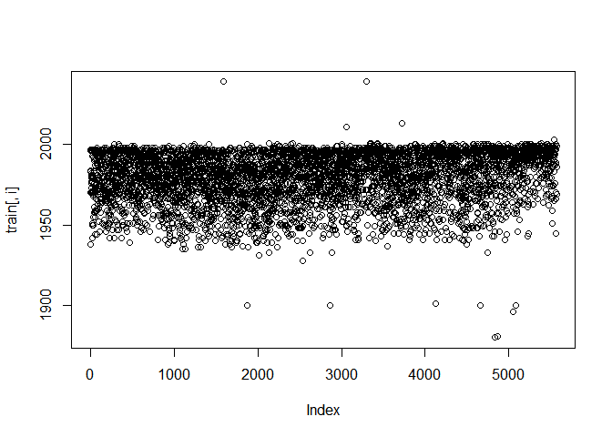
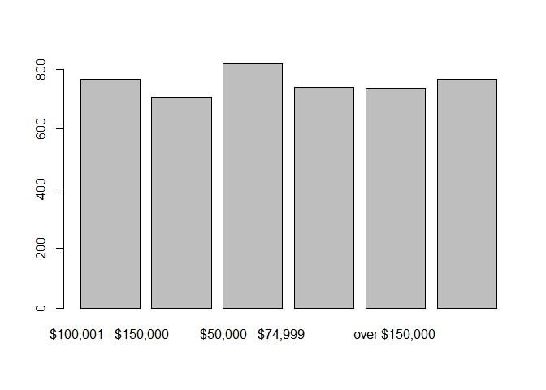
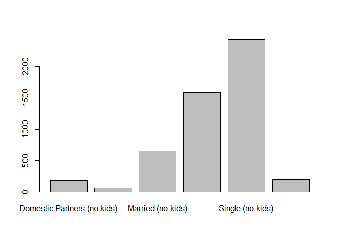
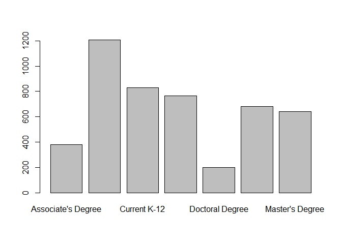
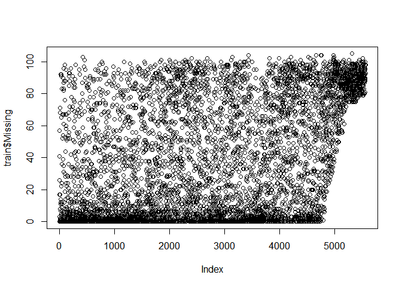
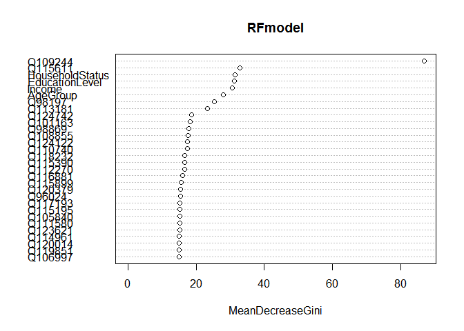

Predicting Voting Outcomes
================
Vinyas
6 July 2016

##### What predicts voting outcomes? In this competition, data from Show of Hands is used, an informal polling platform for use on mobile devices and the web, to see what aspects and characteristics of people's lives predict how they will be voting for the presidential election.

    File description

    Here is a description of the files you have been provided for this competition: 

    train2016.csv - the training set of data that you should use to build your models

    test2016.csv - the test set that you will be evaluated on. 
    It contains all of the independent variables, but not the dependent variable.

    sampleSubmission2016.csv - a sample submission file in the correct format.

    Questions.pdf - the question test corresponding to each of the question codes,
    as well as the possible answers.

    Data fields

    USER_ID - an anonymous id unique to a given user

    YOB - the year of birth of the user

    Gender - the gender of the user, either Male or Female

    Income - the household income of the user. 

    HouseholdStatus - the household status of the user.

    EducationalLevel - the education level of the user. 

    Party - the political party for whom the user intends to vote for. 
    Either "Democrat" or "Republican

    Q124742, Q124122, . . . , Q96024 - 101 different questions that the users were asked on Show of Hands. 
    If the user didn't answer the question, there is a blank. 
    For information about the question text and possible answers, see the file Questions.pdf.

###### Read the data

``` r
train=read.csv("train2016.csv",na.strings = c("","NA"))
test=read.csv("test2016.csv",na.strings = c("","NA"))
```

###### Know the structure of the data and find out if any NA values exist

``` r
summary(train)
summary(test)
```

###### Visualize the missing data

``` r
library(Amelia)
missmap(train[,1:6],main = "Missing Values vs Observed",col = c("Red","White"),rank.order = T,y.cex = 0.001)
```

<!-- -->

##### Visualize the demographic data to find outliers/absurd values

``` r
for (i in 2:6) {
plot(train[,i])  
}
```

<!-- --><!-- --><!-- --><!-- --><!-- -->

##### Since we see a lot of outliers in Age, we need more info to treat them

``` r
outliers = subset(train,train$YOB>2000 | train$YOB<1910)
#Outliers in Train
print(outliers$YOB)
```

    ##  [1] 2039 1900 2001 2001 1900 2011 2039 2001 2001 2001 2013 1901 2001 1900
    ## [15] 1880 1881 1896 1900 2001 2003

``` r
outliers=subset(test,test$YOB>2000 | test$YOB<1910)
#Outliers in Test
print(outliers$YOB)
```

    ## [1] 1900 1900 2003

##### So we can see we have absurd values in YOB as 2039 or some less than 1900.

##### Removing absurd value and imputing values around 1900

``` r
train <- subset(train, (train$YOB <= 2016 & train$YOB>=1900) | is.na(train$YOB))
#Find median of YOB in train and test data
median(subset(train$YOB, train$YOB != 1900), na.rm=TRUE)
```

    ## [1] 1983

``` r
median(subset(test$YOB, test$YOB != 1900), na.rm=TRUE)
```

    ## [1] 1984

``` r
test$YOB[test$YOB == 1900 & !is.na(test$YOB)] <- 1984

train$YOB[train$YOB == 1901 & !is.na(train$YOB)] <- 1983
train$YOB[train$YOB == 1900 & !is.na(train$YOB)] <- 1983
rm(outliers)
```

##### Find out the number of NA's in one row and add the same in a column

``` r
train$Missing=as.numeric(apply(train, 1, function(z) sum(is.na(z))))
plot(train$Missing)
```

<!-- -->

``` r
#Remove rows with more than 50 NA's
train=train[train$Missing<50,]
train$Missing<-NULL
```

##### Impute the missing values for demographic data using mice package

``` r
library(mice)
train[,2:6]=complete(mice(train[,2:6]))
test[,2:6]=complete(mice(test[,2:6]))
```

##### Bind the data so we can create groups

``` r
Party<-train$Party
train$Party<-NULL
#Made equal number of columns since we do not have predictions in Test
row_train<-nrow(train)
row_test<-nrow(test)
data <- rbind(train, test)
```

##### Create AgeGroup

``` r
AgeGroup <- vector(mode="character", length1<-nrow(data))
for(i in 1:length1)
{
  age <- 2016 - data$YOB[i]
  if(is.na(age)){
    AgeGroup[i] <- NA
      }
  else if(age < 18){
        AgeGroup[i] <- "Under18"
      }
    else if(age >= 18 & age < 25){
       AgeGroup[i] <- "18-24"
      }
   else if(age >= 25 & age < 35){
         AgeGroup[i] <- "25-34"
       }
     else if(age >= 35 & age < 45){
         AgeGroup[i] <- "35-44"
       }
     else if(age >= 45 & age < 55){
         AgeGroup[i] <- "45-54"
       }
   else if(age >= 55 & age < 65){
         AgeGroup[i] <- "55-64"
       }
     else if(age >= 65){
         AgeGroup[i] <- "Over65"
       }
   }
rm(i, age)
AgeGroup <- factor(AgeGroup, c("Under18","18-24","25-34","35-44","45-54",
                               "55-64","Over65"), ordered = TRUE)
```

##### Reorder Income and EducationLevel

``` r
data$Income <- factor(data$Income, levels=c("under $25,000",
                                            "$25,001 - $50,000",
                                            "$50,000 - $74,999",
                                            "$75,000 - $100,000",
                                            "$100,001 - $150,000",
                                            "over $150,000"),
                      ordered = TRUE)

data$EducationLevel <- factor(data$EducationLevel, 
                              levels=c("Current K-12","High School Diploma",
                                       "Associate's Degree",
                                       "Current Undergraduate",
                                       "Bachelor's Degree",
                                       "Master's Degree","Doctoral Degree"),
                              ordered = TRUE)
```

##### Split the data back into train and test data set

``` r
data$YOB <- NULL
USER_ID <- data$USER_ID
data <- cbind(USER_ID, AgeGroup, data[,2:106])
questions = grep("^Q",names(data))
# loop over all the questions
for (i in questions) {
    data[[i]] = factor(data[[i]],exclude = NULL)
}
rm(USER_ID, AgeGroup)
train <- data[1:row_train,]
test <- data[(row_train+1):length1,]
#Add the dependent variable back in the train set
train$Party<-Party
rm(Party.data)
```

##### Create Log Model

``` r
LogModel=glm(Party~ . - USER_ID,data = train,family = binomial)

prediction=predict(LogModel,newdata= test,type = "response")

PredTestLabels = as.factor(ifelse(prediction<0.5, "Democrat", "Republican"))

MySubmission = data.frame(USER_ID = test$USER_ID, Predictions = PredTestLabels)

write.csv(MySubmission, file="SubmissionLog.csv", row.names=FALSE)

summary(LogModel)
```

##### Create Random Forest Models

``` r
set.seed(200)
library(randomForest)

for(i in 2:107){levels(train[[i]])[is.na(levels(train[[i]]))] <- "NA"}
for(i in 2:107){levels(test[[i]])[is.na(levels(test[[i]]))] <- "NA"}
for (i in 2:107){ levels(train[i])<-levels(test[i])}

RFmodel=randomForest(Party~ . - USER_ID,data = train,method="class")

rf_basic=predict(RFmodel,newdata = test,type = "class")

MySubmission = data.frame(USER_ID = test$USER_ID, Predictions = rf_basic)

write.csv(MySubmission, file = "SubmissionRFBasic.csv", row.names=FALSE)

varImpPlot(RFmodel)
```

<!-- -->

``` r
#RF Model 2

RFModel2 = randomForest(Party ~ AgeGroup + Gender + Income + HouseholdStatus + EducationLevel + Q98197+ Q98869 + Q99480 + Q101163 + Q106272 + Q108617 + Q108754 + Q108855 + Q109244  + Q112512 + Q113181 + Q115195 + Q115610 + Q115611 + Q115899 + Q116601 + Q116953 + Q118117 + Q118232 + Q119851 + Q120379  ,data = train,method="class",ntree=3000)

rf_predict_1=predict(RFModel2,newdata = test,type = "class")

MySubmission2 = data.frame(USER_ID = test$USER_ID, Predictions = rf_predict_1)

write.csv(MySubmission2, file = "SubmissionRF2.csv", row.names=FALSE)

#RF Model 3

RFmodel_final=randomForest(Party~ AgeGroup + Gender + Income + HouseholdStatus + EducationLevel + Q109244 + Q115611 + Q98197 + Q113181 + Q98869 + Q101163 + Q99480 + Q105840 + Q120379 + Q116881 + Q106272 + Q120472 + Q115899 + Q102089 + Q110740 + Q119851 + Q121699 + Q118232 + Q100680 + Q118892,data =train,method="class",ntree=3000)

rf_predict_2=predict(RFmodel_final,newdata = test,type = "class")

MySubmission3 = data.frame(USER_ID = test$USER_ID, Predictions = rf_predict_2)

write.csv(MySubmission3, file = "SubmissionRFFinal.csv", row.names=FALSE)
```
